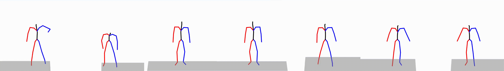

# Text to Motion Retrieval

## Overview
This is the official code for reproducing results obtained in the short paper [Text-to-Motion Retrieval: Towards Joint Understanding of Human Motion Data and Natural Language](https://dl.acm.org/doi/abs/10.1145/3539618.3592069).

:fire: This paper won the [Best Short Paper Award Honorable Mention](https://sigir.org/sigir2023/program/best-paper-award/) at [SIGIR 2023](https://sigir.org/sigir2023/).

This repository is intended to be a codebase - easy to expand with novel motion encoders, text encoders, and loss functions - to develop novel approaches for text-to-motion (and motion-to-text) retrieval.

<table>
  <tr>
    <td><i>"A person walks in a counterclockwise circle"</i></td>
    <td></td>
   </tr>
   <tr>
      <td><i>"A person is kneeling down on all four legs and begins to crawl"</i></td>
      <td></td>
  </tr>
</table>

## Performance

* HumanML3D

| Text Model    | Motion Model   | R@1  | R@5  | R@10  | meanr | medr | SPICE | spaCy |
|---------------|----------------|------|------|------|------|-----|-------|-------|
| BERT+LSTM     | BiGRU          | 2.9 | 11.8 | 19.8 | 253.9| 55  | 0.250 | 0.768 |
| BERT+LSTM     | UpperLowerGRU  | 2.4 | 10.5 | 17.7 | 285.7| 68  | 0.242 | 0.763 |
| BERT+LSTM     | DG-STGCN       | 2.0 | 8.4  | 14.4 | 242.0| 73  | 0.231 | 0.767 |
| BERT+LSTM     | MoT (our)      | 2.5 | 11.2 | 19.4 | 234.5| 51  | 0.247 | 0.768 |
| CLIP          | BiGRU          | 3.4 | 14.3 | 23.1 | 201.9| 43  | 0.272 | 0.780 |
| CLIP          | UpperLowerGRU  | 3.1 | 12.6 | 20.8 | 200.4| 47  | 0.269 | 0.779 |
| CLIP          | DG-STGCN       | 4.1 | 16.0 | 26.5 | 159.6| 33  | 0.291 | 0.789 |
| CLIP          | MoT (our)      | 3.5 | 14.8 | 24.5 | 166.2| 38  | 0.280 | 0.785 |

* KIT ML

| Text Model    | Motion Model   | R@1  | R@5   | R@10  | mean | med | SPICE | spaCy |
|---------------|----------------|-----|------|------|------|-----|-------|-------|
| BERT+LSTM     | BiGRU          | 3.7 | 15.2 | 23.8 | 72.3 | 30  | 0.271 | 0.706 |
| BERT+LSTM     | UpperLowerGRU  | 3.2 | 15.7 | 25.3 | 90.2 | 34  | 0.263 | 0.697 |
| BERT+LSTM     | DG-STGCN       | 6.2 | 24.5 | 38.2 | 40.6 | 17  | 0.339 | 0.740 |
| BERT+LSTM     | MoT (our)      | 5.3 | 21.3 | 32.0 | 51.1 | 20  | 0.318 | 0.723 |
| CLIP          | BiGRU          | 6.6 | 21.5 | 32.3 | 52.0 | 22  | 0.316 | 0.729 |
| CLIP          | UpperLowerGRU  | 6.4 | 22.0 | 32.2 | 52.3 | 22  | 0.321 | 0.732 |
| CLIP          | DG-STGCN       | 7.2 | 26.1 | 38.2 | 36.9 | 16  | 0.355 | 0.751 |
| CLIP          | MoT (our)      | 6.5 | 26.4 | 42.6 | 35.5 | 14  | 0.352 | 0.748 |


## Getting started

This code was tested on `Ubuntu 18.04 LTS` and requires:

* Python 3.10
* Conda
* CUDA capable GPU (one is enough)

### 1. Setup environment

Clone this repo and move into it:
```
git clone https://github.com/mesnico/text-to-motion-retrieval
cd text-to-motion-retrieval
```

Create a new conda environment and activate it:
```
conda create -n t2m python=3.10
conda activate t2m
```

Install dependencies:
```
pip install -r requirements.txt
```

### 2. Data preparation

**HumanML3D** - Follow the instructions in [HumanML3D](https://github.com/EricGuo5513/HumanML3D.git),
then copy the result dataset to this repository:

```
cp -r ../HumanML3D/HumanML3D ./dataset/HumanML3D
```

**KIT** - Download from [HumanML3D](https://github.com/EricGuo5513/HumanML3D.git) (no processing needed this time) and the place result in `./dataset/KIT-ML`

**Compute Text Similarities** - This is needed to pre-compute the relevances for NDCG metric to use during validation and testing.
<!-- You have to download the precomputed text similarities from ... and place them under `outputs/computed_relevances`. -->
You can compute them by running the following command:
```
python text_similarity_utils/compute_relevance --set [val|test] --method spacy --dataset [kit|humanml]
```
*Note 1*: with respect to the paper, here we compute only the spacy relevance, given that the spice is slow and hard to calculate.

*Note 2*: to avoid errors, you should compute similarities using all the 4 configurations of parameters, by invoking the command using all the combinations of sets (val and test), and datasets (kit and humanml).

### 3. Train

Run the command
```
bash reproduce_train.sh
```
Modify che code appropriately for including/excluding models or loss functions.
This code will create a folder `./runs` where checkpoints and training metrics (tensorboard logs) are stored for each model.

### 4. Test

Run the command
```
bash reproduce_eval.sh
```
Modify che code appropriately following the models and loss functions included in `reproduce_train.sh`. Non-existing configurations will be skipped.

### 5. Result tables

Open the `show.ipynb` notebook to produce the tables shown in the paper. 

*NOTE: This is still WIP so there may be some runtime errors unless some changes are made to the code*

### 6. Visualize retrieval results

Run the command
```
bash render.sh
```
Modify che code appropriately to employ a specific model and specific query ids.
The resulting videos are placed in the folder `outputs/renders`.

## Implementation Details

This repo is fully modular and based on the [Hydra](https://hydra.cc/docs/intro/) framework. For this reason, it is also quite easy to extend our text-to-motion framework to handle custom motion encoders, text encoders, and different loss functions.

The `config` folder is the root configuration path for Hydra.

To add another motion-encoder, text-encoder, or loss-function, you need:
1. To write the pytorch code placing it inside the appropriate `losses`, `motions`, `texts` folder
2. Expose your class as a module in the `__init__.py` file
3. Write a `.yaml` configuration file , making sure that `module._target_` points to that class
4. Update the `reproduce_train.sh` and `reproduce_eval.sh` files to include the novel configuration (without `.yaml` extension) to the pool of experiments

## Acknowledgements

This repo is largely based on the [Motion Diffusion Model (MDM)](https://github.com/GuyTevet/motion-diffusion-model) repository. We are grateful to its authors.

## License
This code is distributed under an [MIT LICENSE](LICENSE).

Note that our code depends on other libraries, including TERN, TERAN, CLIP, SMPL, SMPL-X, and uses datasets that each have their own respective licenses that must also be followed.
